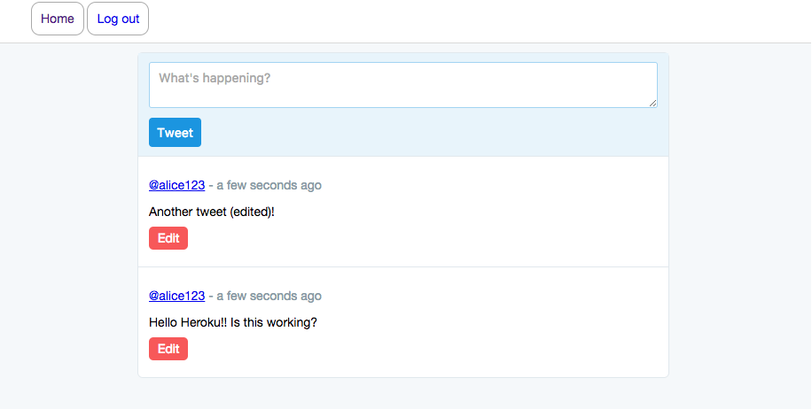

### Simple Twitter Clone

DEMO: https://twitclone123.herokuapp.com/




Node.js MySQL Twitter Clone

```sh
brew update
brew install homebrew/versions/mysql56
mysql.server start
```

After start MySQL
```
mysql -u root
> source start.sql
```

Stop / Restart MySQL
```
mysql.server stop
mysql.server restart 
```

Start Redis server (install redis-cli)

```sh
redis-server
redis-cli # Shell command
```

### Run Locally

```
redis-server
npm run start
```

### Env variables

```sh
NODE_ENV # 'development' (default)
DB_HOST # 'localhost' (default)
DB_USER # 'root' (default)
DB_NAME # 'twitclone' (default)
DB_PASSWORD # '' (default)
PORT # 8080 (default)
REDIS_URL # '' (default)
```